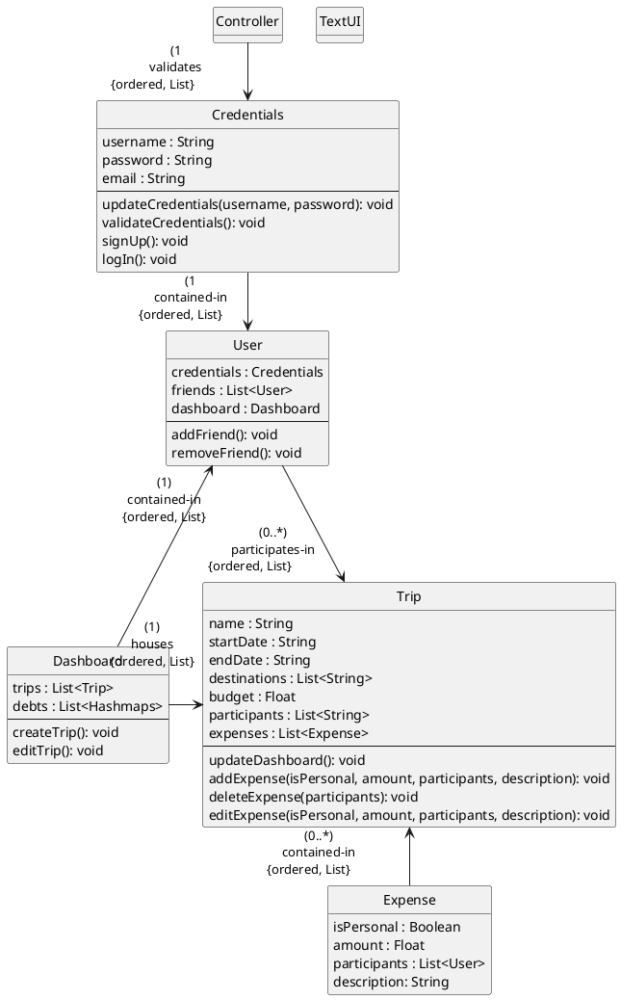

```plantuml
@startuml
hide circle
hide empty methods
' classes
class Controller{
}

class Credentials{
username : String
password : String
email : String
--
updateCredentials(username, password): void
validateCredentials(): void
signUp(): void
logIn(): void
}

class User{
credentials : Credentials
friends : List<User>
dashboard : Dashboard
--
addFriend(): void
removeFriend(): void
}

class Dashboard{
trips : List<Trip>
debts : List<Hashmaps>
--
createTrip(): void
editTrip(): void
}

class Trip{
name : String
startDate : String
endDate : String
destinations : List<String>
budget : Float
participants : List<String>
expenses : List<Expense>
--
updateDashboard(): void
addExpense(isPersonal, amount, participants, description): void
deleteExpense(participants): void
editExpense(isPersonal, amount, participants, description): void
}

class Expense{
isPersonal : Boolean
amount : Float
participants : List<User>
description: String
}

class TextUI{
}

' associations
Dashboard -> "(1)\nhouses\n{ordered, List}" Trip
Expense -up-> "(0..*)\ncontained-in\n\t{ordered, List}\t\t" Trip
User -> "(0..*)\nparticipates-in\n{ordered, List}\t\t" Trip
Controller -down-> "(1\nvalidates\n{ordered, List}\t\t" Credentials
Credentials --> "(1\ncontained-in\n{ordered, List}\t" User
Dashboard -up--> "(1)\ncontained-in\n{ordered, List}" User
@enduml
```